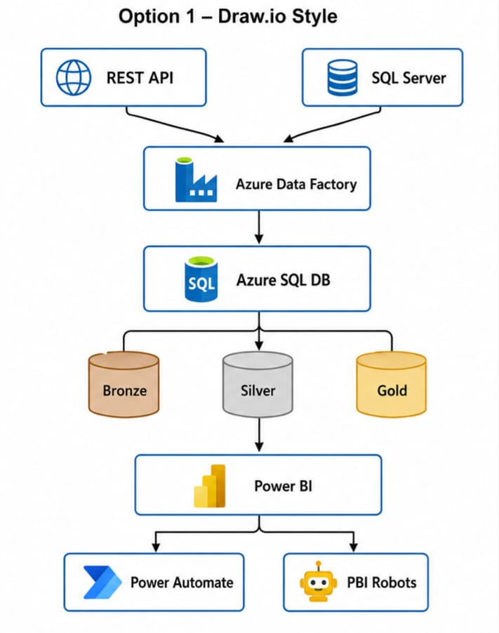
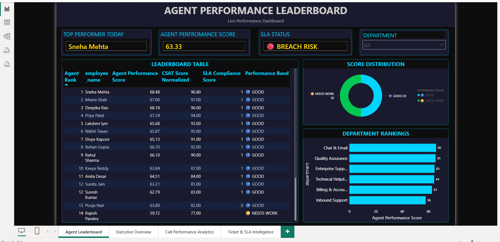
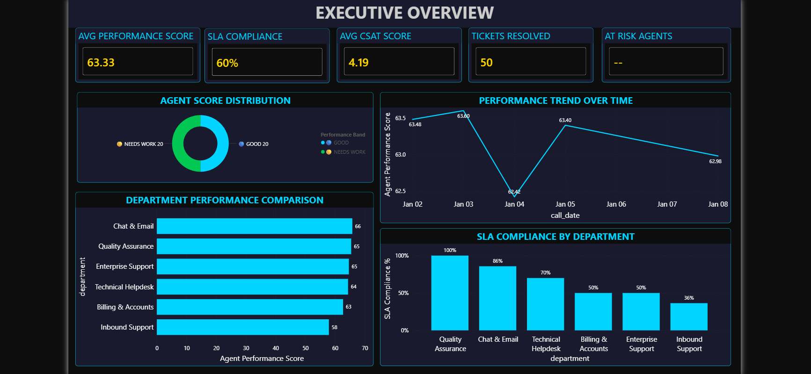
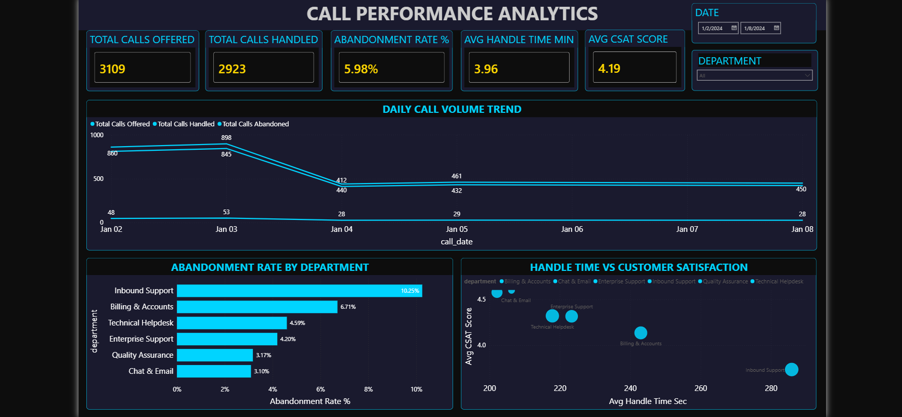
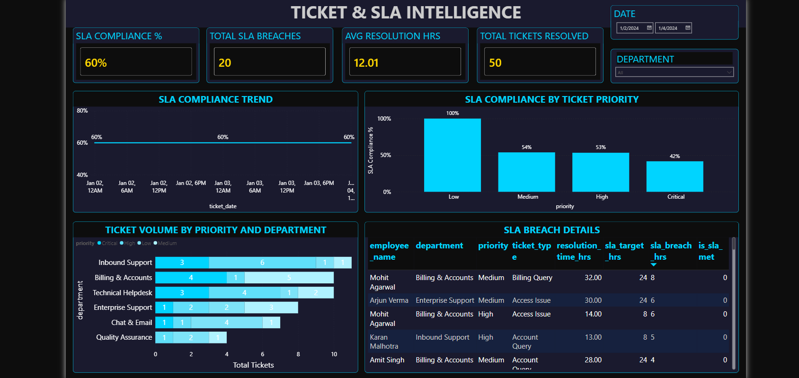

# 📊 Customer Service Intelligence Platform
### Azure Data Factory · SQL Server · Power BI · Power Automate · Power BI Robots

---

## 📋 Business Problem

NovaCare Solutions manages 500 customer service agents across
6 departments handling inbound calls, tickets, and chat support.

*The problems leadership faced:*
- SLA breaches were discovered AFTER they happened — no early warning
- Agent performance data lived in 3 disconnected systems
- Managers waited 2 days for Excel reports that were already stale
- No standardized way to measure and reward top performers

---

## ✅ What This Platform Delivers

- Pulls call + ticket data daily from REST APIs via Azure Data Factory
- Cleans and validates through Bronze → Silver → Gold SQL layers
- Computes a transparent Agent Performance Score (0–100)
- Live TV leaderboard dashboard for real-time team visibility
- Automated SLA breach alerts via Power Automate
- Daily PDF reports delivered to managers via Power BI Robots

---

## 📈 Business Impact

| Metric | Before | After |
|---|---|---|
| Reporting cycle | 2 days manual | Automated by 8AM |
| SLA breach detection | End of week | Next morning alert |
| Manager reporting effort | 20 hrs/week | 0 hrs/week |
| Performance scoring | Subjective | Transparent 0–100 |
| Stakeholders served | 5 managers | 200+ via dashboard |

---

## 🏗️ Architecture

*Data Flow:*
REST APIs (Call + Ticket)

+

SQL Server (Employee/HR)

Azure Data Factory (Daily 6AM pipeline)

Azure SQL - Bronze Layer (raw data)

Azure SQL - Silver Layer (cleaned + validated)

Azure SQL - Gold Layer (Star Schema)

Power BI Dashboard (5 pages)

Power Power BI Automate Robots (Alerts) (PDF Reports)
---

## 🛠️ Tech Stack

| Layer | Technology |
|---|---|
| Ingestion | Azure Data Factory (HTTP + SQL connectors) |
| Storage | Azure SQL Database |
| Transformation | T-SQL (Stored Procedures) |
| Data Model | Star Schema — Bronze / Silver / Gold |
| Visualization | Power BI Desktop + Power BI Service |
| Alerting | Power Automate |
| Report Delivery | Power BI Robots |

---

## 📊 Dashboard Pages

| Page | Purpose |
|---|---|
| 🏆 Agent Leaderboard | Live TV screen — real-time rankings |
| 📊 Executive Overview | C-suite KPI summary |
| 📞 Call Performance | Call volume, AHT, abandonment |
| 🎫 Ticket & SLA | SLA compliance, breach tracking |
### Screenshots

---

## 🧮 KPI Scoring Methodology

*Agent Performance Score (0–100) — weighted composite:*

| Component | Weight | Formula |
|---|---|---|
| Call Handle Rate | 25% | Calls handled / calls offered |
| CSAT Score | 25% | Customer rating normalized to 0–100 |
| SLA Compliance | 20% | Tickets resolved within SLA target |
| Ticket Volume | 15% | Tickets resolved vs daily target (10) |
| Efficiency | 15% | Handle time vs 4-minute target |

*Score Bands:*
- 🌟 STAR (90–100)
- 🟢 HIGH (75–89)
- 🔵 GOOD (60–74)
- 🟡 NEEDS WORK (45–59)
- 🔴 AT RISK (0–44)

---

## 📁 Project Structure
customer-service-intelligence-platform/

← Architecture diagram, ERD, KPI definitions

← All SQL scripts numbered in execution order

docs/

sql/

adf/ ← Azure Data Factory pipeline definitions

data/sample/

powerbi/

automation/

—README.md
---

## 🚀 How to Run Locally
1. Open SQL Server Management Studio (SSMS)

2. Run SQL scripts in order: 01 → 02 → 03 → 04

3. Load sample data from data/sample/ folder

4. Run scripts 05 → 06 → 07 → 08 → 09

5. Open Power BI file from powerbi/ folder

6. Update connection string to your local SQL Server

7. Refresh the dataset
---

## 📂 Data Sources

| Dataset | Source | Used For |
|---|---|---|
| IBM HR Analytics | [Kaggle](https://www.kaggle.com/datasets/pavansubhasht/ibm-hr-analytics-attrition-dataset) | Employee dimension |
| Customer Support Tickets | [Kaggle](https://www.kaggle.com/datasets/suraj520/customer-support-ticket-dataset) | Ticket + SLA data |
| Call Center Data | [Mockaroo](https://mockaroo.com) synthetic | Call metrics |

> All data is synthetic or publicly available.
> No confidential business information is used.

---

## 👤 Author

*Gunjan Khatri*
Data Analyst | Power BI Developer | Azure Data Factory

---

## 📄 License
MIT License — created for portfolio demonstration purposes.